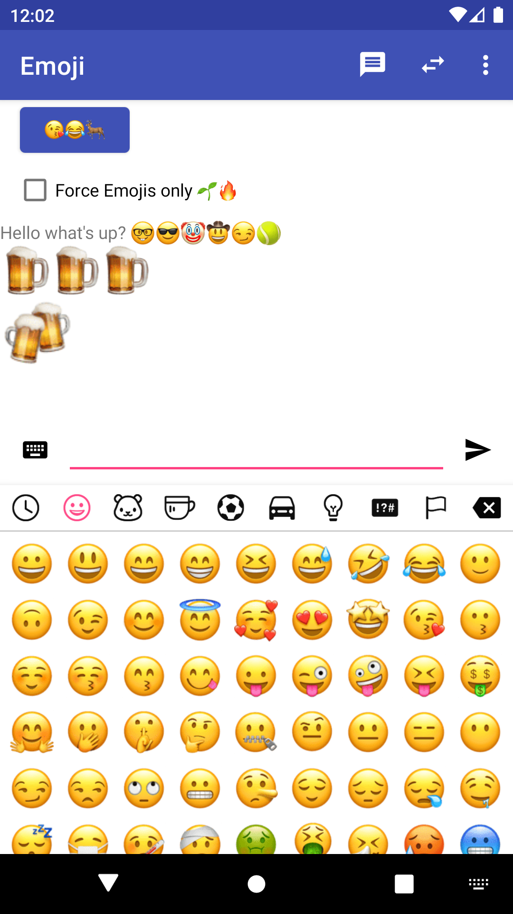
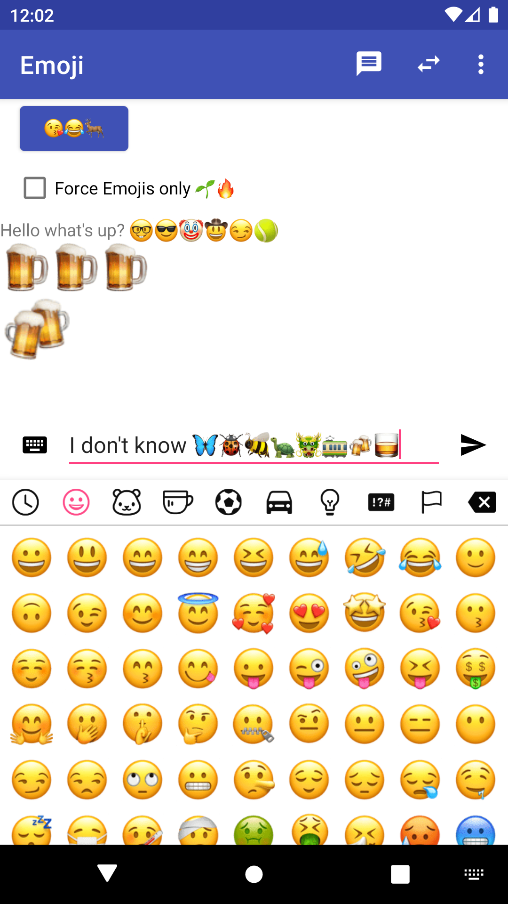
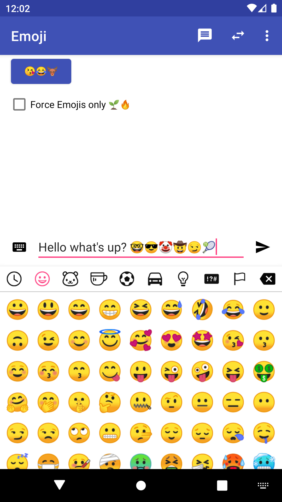
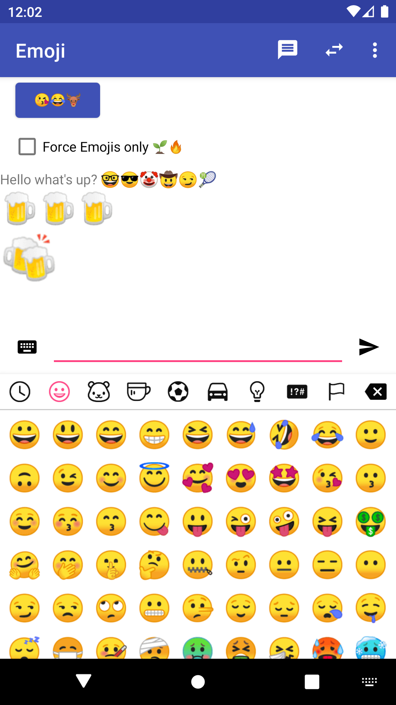
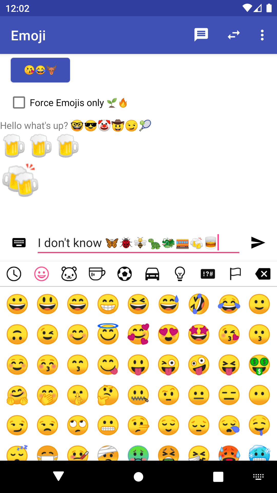
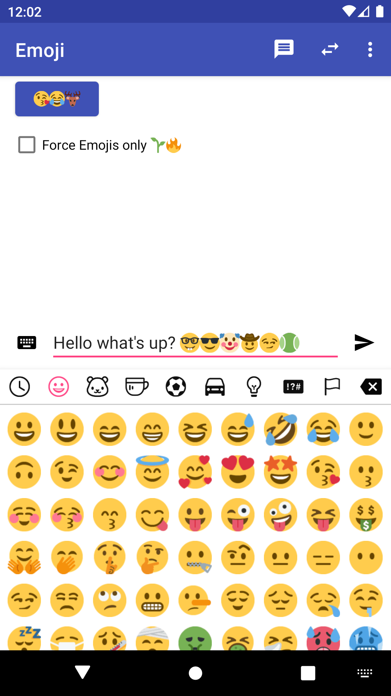
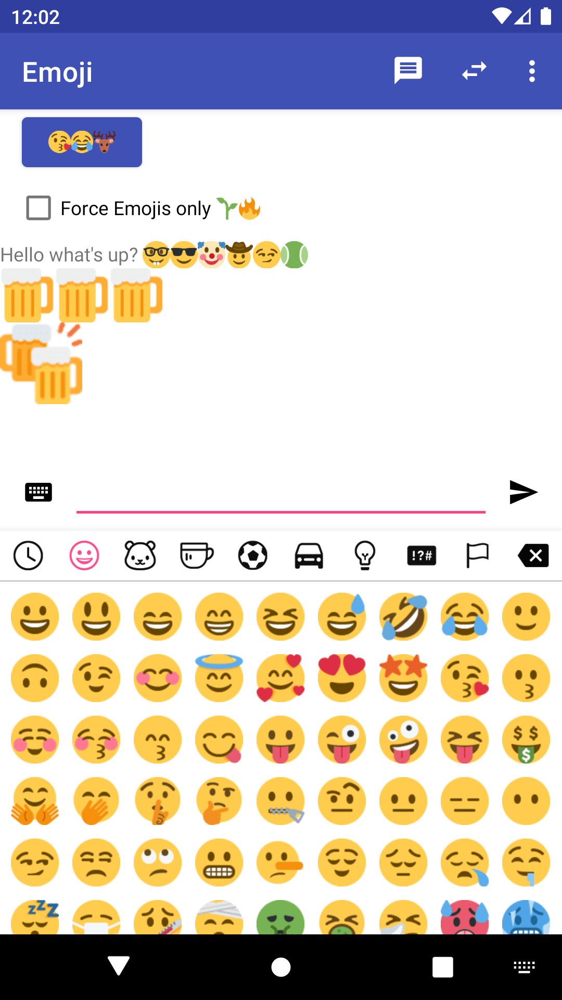
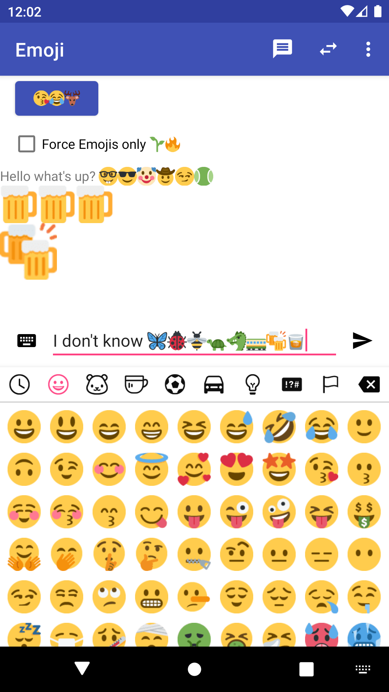

# Emoji

A library to add Emoji support to your Android app. Emojis can be picked in a PopupWindow. In order to edit and display text with Emojis this library provides public APIs:

- [`EmojiAutoCompleteTextView`](emoji/src/main/java/com/vanniktech/emoji/EmojiAutoCompleteTextView.java)
- [`EmojiButton`](emoji/src/main/java/com/vanniktech/emoji/EmojiButton.java)
- [`EmojiCheckbox`](emoji/src/main/java/com/vanniktech/emoji/EmojiCheckbox.java)
- [`EmojiEditText`](emoji/src/main/java/com/vanniktech/emoji/EmojiEditText.java)
- [`EmojiMultiAutoCompleteTextView`](emoji/src/main/java/com/vanniktech/emoji/EmojiMultiAutoCompleteTextView.java)
- [`EmojiTextView`](emoji/src/main/java/com/vanniktech/emoji/EmojiTextView.java)

There's also a [`EmojiLayoutFactory`](emoji/src/main/java/com/vanniktech/emoji/EmojiLayoutFactory.java), which can be used to get automatic Emoji support when using normal Android Views such as `TextView`, `Checkbox`, etc.

Material Design Library bindings can be included via:

```groovy
implementation 'com.vanniktech:emoji-material:0.7.0'
```

- [`EmojiMaterialButton`](emoji-material/src/main/java/com/vanniktech/emoji/material/EmojiMaterialButton.java)
- [`EmojiMaterialRadioButton`](emoji-material/src/main/java/com/vanniktech/emoji/material/EmojiMaterialRadioButton.java)
- [`MaterialCheckBox`](emoji-material/src/main/java/com/vanniktech/emoji/material/MaterialCheckBox.java)

There's also a [`MaterialEmojiLayoutFactory`](emoji-material/src/main/java/com/vanniktech/emoji/material/MaterialEmojiLayoutFactory.java), which can be used to get automatic Emoji support.

The library has 4 different providers to choose from ([iOS](#ios-emojis), [Google](#google), [Facebook](#facebook) & [Twitter](#twitter)).

## iOS Emojis



For getting the above iOS Emojis simply add the dependency and code below.

```groovy
implementation 'com.vanniktech:emoji-ios:0.7.0'
```

And install the provider in your application class.

```java
EmojiManager.install(new IosEmojiProvider());
```

## Google



For getting the above Google Emojis simply add the dependency and code below.

```groovy
implementation 'com.vanniktech:emoji-google:0.7.0'
```

And install the provider in your application class.

```java
EmojiManager.install(new GoogleEmojiProvider());
```

## Facebook


For getting the above Facebook Emojis simply add the dependency and code below.

```groovy
implementation 'com.vanniktech:emoji-facebook:0.7.0'
```

And install the provider in your application class.

```java
EmojiManager.install(new GoogleEmojiProvider());
```

## Twitter



For getting the above Twitter Emojis simply add the dependency and code below.

```groovy
implementation 'com.vanniktech:emoji-twitter:0.7.0'
```

And install the provider in your application class.

```java
EmojiManager.install(new TwitterEmojiProvider());
```

## Custom Emojis

If you want to display your own Emojis you can create your own implementation of [`EmojiProvider`](emoji/src/main/java/com/vanniktech/emoji/EmojiProvider.java) and pass it to `EmojiManager.install`.

All of the core API lays in `emoji`, which is being pulled in automatically by the provided implementations:

```groovy
implementation 'com.vanniktech:emoji:0.7.0'
```

## Set up

### Inserting Emojis

Declare your [`EmojiEditText`](emoji/src/main/java/com/vanniktech/emoji/EmojiEditText.java) in your layout xml file.

```xml
<com.vanniktech.emoji.EmojiEditText
  android:id="@+id/emojiEditText"
  android:layout_width="match_parent"
  android:layout_height="wrap_content"
  android:imeOptions="actionSend"
  android:inputType="textCapSentences|textMultiLine"
  android:maxLines="3"/>
```

To open the [`EmojiPopup`](emoji/src/main/java/com/vanniktech/emoji/EmojiPopup.java) execute the code below:

```java
final EmojiPopup emojiPopup = EmojiPopup.Builder.fromRootView(rootView).build(emojiEditText);
emojiPopup.toggle(); // Toggles visibility of the Popup.
emojiPopup.dismiss(); // Dismisses the Popup.
emojiPopup.isShowing(); // Returns true when Popup is showing.
```

The `rootView` is the rootView of your layout xml file which will be used for calculating the height of the keyboard.
`emojiEditText` is the [`EmojiEditText`](emoji/src/main/java/com/vanniktech/emoji/EmojiEditText.java) that you declared in your layout xml file.

### Displaying Emojis

```xml
<com.vanniktech.emoji.EmojiTextView
  android:id="@+id/emojiTextView"
  android:layout_width="wrap_content"
  android:layout_height="wrap_content"/>
```

Just use the [`EmojiTextView`](emoji/src/main/java/com/vanniktech/emoji/EmojiTextView.java) and call `setText` with the String that contains Unicode encoded Emojis. To change the size of the displayed Emojis use the `lineHeight` property from TextView.

### EmojiPopup Listeners

The [`EmojiPopup`](emoji/src/main/java/com/vanniktech/emoji/EmojiPopup.java) builder allows you to declare several listeners.

```java
setOnSoftKeyboardCloseListener(OnSoftKeyboardCloseListener listener);
setOnEmojiClickListener(OnEmojiClickListener listener);
setOnSoftKeyboardOpenListener(OnSoftKeyboardOpenListener listener);
setOnEmojiPopupShownListener(OnEmojiPopupShownListener listener);
setOnEmojiPopupDismissListener(OnEmojiPopupDismissListener listener);
setOnEmojiBackspaceClickListener(OnEmojiBackspaceClickListener listener);
```

### EmojiPopup Configuration

#### Custom Recent Emoji implementation

You can pass your own implementation of the recent Emojis. Implement the [`RecentEmoji`](emoji/src/main/java/com/vanniktech/emoji/RecentEmoji.java) interface and pass it when you're building the [`EmojiPopup`](emoji/src/main/java/com/vanniktech/emoji/EmojiPopup.java):

```java
setRecentEmoji(yourClassThatImplementsRecentEmoji)
```

If no instance or a null instance is set the [default implementation](./emoji/src/main/java/com/vanniktech/emoji/RecentEmojiManager.java) will be used.

#### Custom Variant Emoji implementation

You can pass your own implementation of the variant Emojis. Implement the [`VariantEmoji`](emoji/src/main/java/com/vanniktech/emoji/VariantEmoji.java) interface and pass it when you're building the [`EmojiPopup`](emoji/src/main/java/com/vanniktech/emoji/EmojiPopup.java):

```java
setVariantEmoji(yourClassThatImplementsVariantEmoji)
```

If no instance or a null instance is set the [default implementation](./emoji/src/main/java/com/vanniktech/emoji/VariantEmojiManager.java) will be used.

### Animations

#### Custom keyboard enter and exit animations

You can pass your own animation style for enter and exit transitions of the Emoji keyboard while you're building the [`EmojiPopup`](emoji/src/main/java/com/vanniktech/emoji/EmojiPopup.java):

```java
setKeyboardAnimationStyle(R.style.emoji_fade_animation_style);
```

If no style is set the keyboard will appear and exit as a regular PopupWindow.
This library currently ships with two animation styles as an example:

- R.style.emoji_slide_animation_style
- R.style.emoji_fade_animation_style

#### Custom page transformers

You can pass your own Page Transformer for the Emoji keyboard View Pager while you're building the [`EmojiPopup`](emoji/src/main/java/com/vanniktech/emoji/EmojiPopup.java):

```java
setPageTransformer(new MagicTransformer());
```

If no transformer is set ViewPager will behave as its usual self. Please do note that this library currently does not ship any example Page Transformers.

### Other goodies

- [`MaximalNumberOfEmojisInputFilter`](emoji/src/main/java/com/vanniktech/emoji/MaximalNumberOfEmojisInputFilter.java) can be used to limit the number of Emojis one can type into an EditText
- [`OnlyEmojisInputFilter`](emoji/src/main/java/com/vanniktech/emoji/OnlyEmojisInputFilter.java) can be used to limit the input of an EditText to emoji only
- [`SingleEmojiTrait`](emoji/src/main/java/com/vanniktech/emoji/SingleEmojiTrait.java) can be used to force a single emoji which can be replaced by a new one
- `EmojiEditText#disableKeyboardInput()` to disable normal keyboard input. To undo call `#enableKeyboardInput()`

# Snapshots

This library is also distributed as a SNAPSHOT if you like to check out the latest features.

> Note: The API is not stable and may change and break your code at any time if you use a SNAPSHOT.

Add this to your repositories:

```groovy
maven { url "https://oss.sonatype.org/content/repositories/snapshots" }
```

And **one** of these to your dependencies:

```groovy
implementation 'com.vanniktech:emoji:0.8.0-SNAPSHOT'
implementation 'com.vanniktech:emoji-ios:0.8.0-SNAPSHOT'
implementation 'com.vanniktech:emoji-google:0.8.0-SNAPSHOT'
implementation 'com.vanniktech:emoji-twitter:0.8.0-SNAPSHOT'
implementation 'com.vanniktech:emoji-facebook:0.8.0-SNAPSHOT'
implementation 'com.vanniktech:emoji-material:0.8.0-SNAPSHOT'
```

# Proguard

No configuration needed.

# License

Copyright (C) 2016 - Niklas Baudy, Ruben Gees, Mario Đanić and contributors

Licensed under the Apache License, Version 2.0
